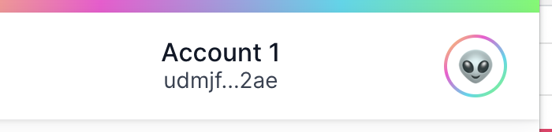

# Daily guide : day 3 🐥

Welcome into the **day 3** of the Motoko FU Hackathon Training! <br/>
Today we will cover the following topics : **Custom type**, **Linked list**, **Principal**, **Hashmap**, **Cycles** (how to deal with upgrades), **stable variables**, **Variant types**, **Result type**, & **HTTP request**.

You can access the official documentation for each topic.

- <a href="https://internetcomputer.org/docs/language-guide/caller-id.html" target="_blank"> Principal </a>.
- <a href="https://internetcomputer.org/docs/base-libraries/HashMap.html" target="_blank"> Hashmap </a>.
- <a href="https://internetcomputer.org/docs/language-guide/upgrades.html" target="_blank"> Stable variables & upgrade </a>.
- <a href="https://internetcomputer.org/docs/developers-guide/concepts/tokens-cycles.html" target="_blank"> Cycles </a>.
- <a href="https://internetcomputer.org/docs/candid-guide/candid-types.html" target="_blank"> Variant </a>.
- <a href="https://smartcontracts.org/docs/language-guide/errors.html#_working_with_optionresult" target="_blank"> Result </a>.

# Prerequisites ✅

- Start a new project called **day_3** and turn on your local replica.

  ```
  dfx new day_3
  cd day_3
  dfx start
  ```

# Custom type 🔧

During the previous days we have manipulated different types (Nat, Text, Bool, Array); today we are creating to create our **own** type !
Create a new file called person.mo in the day_3 folder (next to main.mo) and copy and paste the following declaration.

```
module {

}
```

This is a **module** declaration, contrary to all previous .mo files that were **actor** declarations. <br/>
A module is (just the like the base library modules we've been using) a piece of code that we can import and reuse.

This is how we can create a custom type. If you want your type to be accessible from the outside of the module you need to make it **public**.

```
public type Person = {
  name : Text;
  age : Nat;
};
```

The type Person is also called an **object** with different **fields** (name, age).

Now that we have declared our type we can create our first variable of type Person.

```
let tom : Person = {
  name = "Tom Cruise";
  age = 59;
};
```

You can access any **field** using the **dot** notation.

```
let tom_name = tom.name;
let tom_age = tom.age;
```

In your main.mo file you can **import** the type Person and use it as if it was part of Motoko native types.

```
import Person "person";
actor {
  public type Person = Person.Person;
  let penelope : Person = {
    name = "Penelope Cruz";
    age = 47;
  };

};

```

💡 **Person.Person** simply means : grab the type Person from the Person module.

# Challenge 🎮

Take a break and try completing challenge 1 to 3.

# Linked list 🔗

A linked list is a datastructure, that contrary to array has a **dynamic** size.
It consists of many **nodes** each node contains :

- A value of type T.
- A pointer to the next node or to **_null_**.

<p align="center">  </p>
<p align="center"> <i> <strong> A linked list of Nat</i> </strong> </p>

The first element of this linked list is a node where :

- Value of type **Nat** equals to 12.
- A pointer to next node.

💡 A pointer is just a memory location indicating where a data is stored. You can think of it as an **arrow** indicating where to find the next node.

Here's how one would define a **linked list** in Motoko.

```
public type List<T> = ?(T, List<T>);
```

This means that a List of type T is either :

- **_null_**
- A **couple** of two elements.
  - 1st element is a value of type T.
  - 2nd element is a List of type T.

💡 To acces an element in a **linked list** you need to start from the first node and follow all the nodes until you came accross the value you are looking for. </n> <br/>
This is more complex than with **arrays** where we could just use array[i], but linked lists have other advantages that we will see.

# Challenge 🎮

Take a break and try completing challenge 4 to 6. <br/>

# Switch / Case

We have already seen the switch/case expression in previous lessons, but let's make a quick review.
We can use the switch/case on **optional expression**.
An element of type **List** can be of value **_null_**. We can check it that way.

```
public type List<T> = ?(T, List<T>);
public func is_list_null(list : List<Nat>) : async Text {
        switch(list){
            case(null) {
                return "The list is null... 😢"
            };
            case(?list){
                return "This list is not null 🥳"
            };
        }
    };
```

The switch/case can also be used for testing different **values**.

```
public func month_to_season (month : Text) : async Text {
  switch(month){
    case("January") return "Winter";
    case("February") return "Winter";
    case("March") return "Spring";
    case("April") return "Spring";
    case("May") return "Spring";
    case("June") return "Summer";
    case("July") return "Summer";
    case("August") return "Summer";
    case("September") return "Autumn";
    case("October") return "Autumn";
    case("November") return "Autumn";
    case("December") return "Winter";
    case(_) return "This is not a month";
  }
};
```

The last case statement is used to indicate a default value, in case the value in the switch (in our case the **month**) do not find in any of the previous cases. It will default to the case with the **\_** indicator :

```
case(_) return "This is not a month";
```

You can actually try this function by deploying it in the Motoko Playground and check what value you get back with "April" and then with "Hello".

# Challenge 🎮

Take a break and try completing challenge 7 to 10. <br/>

# Principal 🆔

The notion of **Principal** is specific to the Internet Computer. <br/> A principal is a unique identifier fo all entities on the IC

- A canister has it's own principal (which corresponds to the canister id)
- Each user has it's own principal.
- Your wallet has it's own principal.

You can access the principal of your dfx identity running the following command.

```
dfx identity get-principal
ubetf-42t5l-l64h6-ljrqr-6ztbu-tanvs-jrwiv-a45x4-ucoxp-cqr4i-mqe //My dfx principal
```

<p align="center">  </p>

Here we also have a principal.

Each message on the IC contains the information about the principal of the caller.
You can access this information in Motoko with the following syntax.

```
public shared(msg) func whoami() : async Principal {
    let principal_caller = msg.caller;
    return(principal_caller);
};
```

The principal is accessible using msg.caller.
You can also use this syntax.

```
public shared({caller}) func whoami() : async Principal {
    return(caller);
};
```

On the Internet Computer there is a special principal, it's called the **Anonymous** principal.
The textual version of this principal is **2vxsx-fae**. It corresponds to any user that is not authenticated.

Finally, in Motoko there is a <a href="https://internetcomputer.org/docs/base-libraries/Principal.html" target="_blank"> **Principal** </a> module for basic operations on principals.

# Challenge 🎮

Take a break and try completing challenge 11.

# HashMap 🗝

An HashMap is a **key** / **value** store that allow you to store elements of type **value** and later retrieve them using an element of type **key**.
Usually, we note the type of the keys : **K** & the type of the values : **V**.

You can create an HashMap and use it by importing the **HashMap** module (don't forget the capital M). <br/>
This is how you would instantiate your first HashMap, with **Keys** of type **Principal** and value of type **Name**.

```
import HashMap "mo:base/HashMap";
import Principal "mo:base/Principal";
actor {

    let anonymous_principal : Principal = Principal.fromText("2vxsx-fae");
    let users = HashMap.HashMap<Principal, Text>(0, Principal.equal, Principal.hash);
    users.put(anonymous_principal, "This is the anonymous principal");

    public func test() : async ?Text {
        return(users.get(Principal.fromText("2vxsx-fae")));
    };


};
```

There is a lot going on. At this point you're probably not surprised by the Motoko syntax : HashMap.HashMap, it simply means that we import the HashMap object from the HashMap module. <br/>

Then we have three arguments to instantiate the HashMap.

- 0 corresponds to the initial capacity of the HashMap. The capacity will automatically grow for you everytime you reach the maximum capacity of the HashMap, you don't need to worry about it 🥳.

- Principal.equal is needed to compare the Keys.

- Principal.hash is needed to hash the Keys.

If you are not familiar with the concept of **hash** and **hash table**, I recommend watching this <a href="https://www.youtube.com/watch?v=KyUTuwz_b7Q" target="_blank"> video </a>.

I really encourage you to understand the inner working of the HashMap, that way you'll get why we need to provide Principal.equal & Principal.hash.

Let's move to the pratical application.
You can add values inside the HashMap using the following syntax.

```
import HashMap "mo:base/HashMap";
import Principal "mo:base/Principal";
actor {

    let anonymous_principal : Principal = Principal.fromText("2vxsx-fae");
    let users = HashMap.HashMap<Principal, Text>(0, Principal.equal, Principal.hash);
    users.put(anonymous_principal, "This is the anonymous principal");

    public func test() : async ?Text {
        return(users.get(Principal.fromText("2vxsx-fae")));
    };

};
```

Here I have added the value **"This is the anonymous principal"** with the **Key** that corresponds to the anonymous principal.

Let's try to retrieve our value.

```
import HashMap "mo:base/HashMap";
import Principal "mo:base/Principal";
actor {

    let anonymous_principal : Principal = Principal.fromText("2vxsx-fae");
    let users = HashMap.HashMap<Principal, Text>(0, Principal.equal, Principal.hash);
    users.put(anonymous_principal, "This is the anonymous principal");

    public func test() : async ?Text {
        return(users.get(Principal.fromText("2vxsx-fae")));
    };


};
```

Deploying this actor in the Motoko playground and running the test will return :

```
(opt "This is the anonymous principal")
```

# Challenge 🎮

Take a break and try completing challenge 12 to 15.

# Cycles 💰

Every canister on the Internet Computer consumes **cycles**. Those are used to
measure and pay for **computation** and **storage**. <br/>

This is a table summing up the cost of each common operation in cycles.

<table class="tableblock frame-all grid-all stretch">
<caption class="title">Table 1. Cycles Cost per Transaction (as of July 26, 2021)</caption>
<colgroup>
<col style="width: 33.3333%;">
<col style="width: 33.3333%;">
<col style="width: 33.3334%;">
</colgroup>
<thead>
<tr>
<th class="tableblock halign-left valign-top">Transaction</th>
<th class="tableblock halign-left valign-top">Description</th>
<th class="tableblock halign-right valign-top">All Application Subnets</th>
</tr>
</thead>
<tbody>
<tr>
<td class="tableblock halign-left valign-top"><p class="tableblock">Canister Created</p></td>
<td class="tableblock halign-left valign-top"><p class="tableblock">For creating canisters on a subnet</p></td>
<td class="tableblock halign-right valign-top"><p class="tableblock">100,000,000,000</p></td>
</tr>
<tr>
<td class="tableblock halign-left valign-top"><p class="tableblock">Compute Percent Allocated Per Second</p></td>
<td class="tableblock halign-left valign-top"><p class="tableblock">For each percent of the reserved compute allocation (a scarce resource).</p></td>
<td class="tableblock halign-right valign-top"><p class="tableblock">100,000</p></td>
</tr>
<tr>
<td class="tableblock halign-left valign-top"><p class="tableblock">Update Message Execution</p></td>
<td class="tableblock halign-left valign-top"><p class="tableblock">For every update message executed</p></td>
<td class="tableblock halign-right valign-top"><p class="tableblock">590,000</p></td>
</tr>
<tr>
<td class="tableblock halign-left valign-top"><p class="tableblock">Ten Update Instructions Execution</p></td>
<td class="tableblock halign-left valign-top"><p class="tableblock">For every 10 instructions executed when executing update type messages</p></td>
<td class="tableblock halign-right valign-top"><p class="tableblock">4</p></td>
</tr>
<tr>
<td class="tableblock halign-left valign-top"><p class="tableblock">Xnet Call</p></td>
<td class="tableblock halign-left valign-top"><p class="tableblock">For every inter-canister call performed (includes the cost for sending the request and receiving the response)</p></td>
<td class="tableblock halign-right valign-top"><p class="tableblock">260,000</p></td>
</tr>
<tr>
<td class="tableblock halign-left valign-top"><p class="tableblock">Xnet Byte Transmission</p></td>
<td class="tableblock halign-left valign-top"><p class="tableblock">For every byte sent in an inter-canister call (for bytes sent in the request and response)</p></td>
<td class="tableblock halign-right valign-top"><p class="tableblock">1,000</p></td>
</tr>
<tr>
<td class="tableblock halign-left valign-top"><p class="tableblock">Ingress Message Reception</p></td>
<td class="tableblock halign-left valign-top"><p class="tableblock">For every ingress message received</p></td>
<td class="tableblock halign-right valign-top"><p class="tableblock">1,200,000</p></td>
</tr>
<tr>
<td class="tableblock halign-left valign-top"><p class="tableblock">Ingress Byte Reception</p></td>
<td class="tableblock halign-left valign-top"><p class="tableblock">For every byte received in an ingress message</p></td>
<td class="tableblock halign-right valign-top"><p class="tableblock">2,000</p></td>
</tr>
<tr>
<td class="tableblock halign-left valign-top"><p class="tableblock">GB Storage Per Second</p></td>
<td class="tableblock halign-left valign-top"><p class="tableblock">For storing a GB of data per second</p></td>
<td class="tableblock halign-right valign-top"><p class="tableblock">127,000</p></td>
</tr>
</tbody>
</table>

Each canister has it's own cycle balance and can transfer cycles to other canisters through messages. <br/>
In Motoko, you can use the <a href="https://internetcomputer.org/docs/base-libraries/ExperimentalCycles.html" target="_blank"> ExperimentalCycles </a> module to play and experiment with cycles. (This module is likely to be modified in the future).

This is how you can access the balance of a canister.

```
import Cycles "mo:base/ExperimentalCycles";
actor {

    public func balance() : async Nat {
        return(Cycles.balance())
    };
};
```

Each message sent on the IC contains a number of cycles attached to it.
You can look the available amount with the following code.

```
import Cycles "mo:base/ExperimentalCycles";
actor {

    public func message_available() : async Nat {
        return(Cycles.available())
    };
};
```

If you want to make your users pay in cycles to access a functionality, you can do so.

```
import Cycles "mo:base/ExperimentalCycles";
actor {

    let AMOUNT_TO_PAY : Nat = 100_000;
    public func pay_to_access() : async Text {
        if(Cycles.available() < 100_000) {
            return("This is not enough, send more cycles.");
        }:
        let received = Cycles.accept(AMOUNT_TO_PAY);
        return("Thanks for paying, you are now a premium user 😎");
    };
};
```

# Challenge

Take a break and try completing challenge 16 & 17.

# Stable variables ✏️

By default, when you upgrade a canister you'll will loose all state. 😢 <br/>
Let's say we have a variable called **counter** that been previously incremented; the value of this variable will be reset after an upgrade.

```
actor {

    var my_name : Text = "";

    public func change_name(name : Text) : async () {
        my_name := name;
    };

    public func show_name() : async Text {
        return(my_name)
    };

};
```

Here's what you can experiment with this actor (after deployment on the Motoko playground)

```
change_name("Motoko");
show_name()  // "Motoko"
```

Now let's try to add something and redeploy our canister, we are trying to run an upgrade.

```
actor {

    var new_value : Text = "Let's upgrade";
    var my_name : Text = "";

    public func change_name(name : Text) : async () {
        my_name := name;
    };

    public func show_name() : async Text {
        return(my_name)
    };


};
```

```
show_name() // ""
```

Looks like the canister has forgotten his name..
Fortunately there is a way to keep state accross upgrades in Motoko. <br/> You can do so with **stable variable** !

```
actor {

    stable var my_name : Text = "";

    public func change_name(name : Text) : async () {
        my_name := name;
    };

    public func show_name() : async Text {
        return(my_name)
    };

};
```

If you try the same suite of operations with this actor, you'll notice that the value of the counter is kept accross the upgrade.

Unfortunately only some variables/objects can be defined as stable. <br/> An HashMap for instance, cannot be defined as stable. <br/>

In those cases, you need to use the following systems hooks.

```
 system func preupgrade() {
    // Do something before upgrade
  };

  system func postupgrade() {
    // Do something after upgrade
  };
}
```

The trick is to use the **preupgrade** method to put all data into stable variables, and use to stable variables to reinitialize your canister state.

(For more informations : https://internetcomputer.org/docs/language-guide/upgrades.html)

# Challenge 🎮

Take a break and try completing challenge 18 to 20.

# Variant 🐄

A variant type represents one value that is from exactly **one** of the given cases, or <i> **tags** </i>.

```
type Vehicule = {
    #Car;
    #Moto;
    #Bicycle;
    #Plane;
    #Boat;
};

```

Each <i> **tag** </i> can have it's own type.

```
import Time "mo:base/Time";
actor {
    type Time = Time.Time;
    type Health = {
        #invicible;
        #alive : Nat;
        #dead : Time;
    };
}
```

You will usually combine variants, with the switch/case expression we've seen before.

```
import Time "mo:base/Time";
import Int "mo:base/Int";
import Nat "mo:base/Nat";
actor {

    type Time = Time.Time;
    public type Health = {
        #invicible;
        #alive : Nat;
        #dead : Time;
    };

    public func medical_check(h : Health) : async Text {
        switch(h){
            case(#invicible) {
                return("Woah I've never seen someone with s much energy !");
            };
            case(#alive(n)){
                return("You seem to be in good shape, you have " # Nat.toText(n) # " energy points");
            };
            case(#dead(t)){
                return("💀 since " # Int.toText(t));
            };
        };
    };
}
```

You'll notice that one advantage of using variants, is that our switch/case doesn't need to cover the **(\_) case** !

# Result type ✅ / 🚫

The type Result is extremly useful if you want to propagate errors and indicate to other people/developers what went wrong.

The type **Result** is defined as :

```
type Result<Ok, Err> = {#ok : Ok; #err : Err}
```

This means the type Result is just a variant with two tags #ok and #err. These two tags can be of type **Ok** and type **Err**.

One common type for **Ok** and **Err** is the following.

```
type Result<(), Text> = {#ok ; #err : Text};
```

In case everything went right we just return #ok without additional informations, but if we encounter an error we want to propagate a message in the #err.

```
import Result "mo:base/Result";
import Principal "mo:base/Principal";
actor {
    public type Result = Result.Result;
    public shared ({caller}) func register() : async Result<(), Text> {
        if(Principal.isAnonymous(caller)){
            return #err("You need to be authenticated to register").
        } else {
            // Do something
            return #ok;
        }
    };
};

```

You could also create a variant type **Error** and use it in the Result.

# HTTP request

If you are not familiar with HTTP, I recommend watching this <a href="https://www.youtube.com/watch?v=iYM2zFP3Zn0" target="\_blank"> video </a> first.

Canisters are able to answer http requests directly !

You need to implement an public method called http_request to allow you canister to answer any http call.

In a module called http.mo we will declare the following types.

```
module {
    public type HeaderField = (Text, Text);
    public type Request = {
        body    : Blob;
        headers : [HeaderField];
        method  : Text;
        url     : Text;
    };

    public type Response = {
        body               : Blob;
        headers            : [HeaderField];
        status_code        : Nat16;
        streaming_strategy : ?StreamingStrategy;
    };

      public type StreamingStrategy = {
        #Callback: {
            callback : StreamingCallback;
            token    : StreamingCallbackToken;
        };
    };

    public type StreamingCallback = query (StreamingCallbackToken) -> async (StreamingCallbackResponse);

    public type StreamingCallbackToken =  {
        content_encoding : Text;
        index            : Nat;
        key              : Text;
    };

    public type StreamingCallbackResponse = {
        body  : Blob;
        token : ?StreamingCallbackToken;
    };

};
```

In main.mo

```
import HTTP "http";
import Text "mo:base/Text";
actor {
  public query func http_request(request : HTTP.Request) : async HTTP.Response {
    let response = {
      body = Text.encodeUtf8("Hello world");
      headers = [("Content-Type", "text/html; charset=UTF-8")];
      status_code = 200 : Nat16;
      streaming_strategy = null
      };
      return(response)
    };
};
```

This is how we implement a basic http response for our canister !
Now if you deploy this canister and access it in your browser, you should see a blank page with the text!